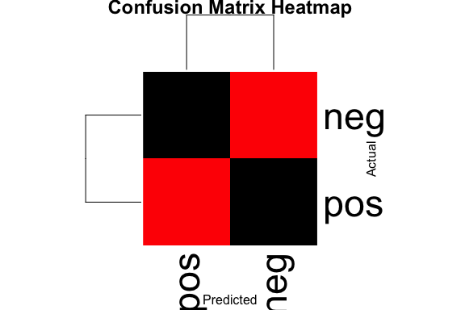

Business Intelligence Lab Submission Markdown
================
Team Marafiki
17/10/2023

- [Student Details](#student-details)
- [Setup Chunk](#setup-chunk)
- [Load the Pima Indians Diabetes
  dataset](#load-the-pima-indians-diabetes-dataset)
- [Naive Bayes model](#naive-bayes-model)
- [linear regression model](#linear-regression-model)
- [logistic Regression model with K-fold
  cross-validation](#logistic-regression-model-with-k-fold-cross-validation)
- [LDA With K-fold cross-validation](#lda-with-k-fold-cross-validation)
- [Naive Bayes with Repeated k-fold Cross
  Validation](#naive-bayes-with-repeated-k-fold-cross-validation)
- [SVM with K-fold cross-validation](#svm-with-k-fold-cross-validation)
- [Naive Bayes with Leave One Out Cross
  Validation](#naive-bayes-with-leave-one-out-cross-validation)

# Student Details

<table>
<colgroup>
<col style="width: 53%" />
<col style="width: 46%" />
</colgroup>
<tbody>
<tr class="odd">
<td><strong>Student ID Numbers and Names of Group Members</strong></td>
<td><ol type="1">
<li><p>136446 - C - Mirav Bhojani</p></li>
<li><p>136788 - C - Derrick Nyaga</p></li>
<li><p>136709 - C - Jane Mugo</p></li>
<li><p>136895 - C - Wesley Wanyama</p></li>
<li><p>135399 - C - Sheilla Kavinya</p></li>
</ol></td>
</tr>
<tr class="even">
<td><strong>GitHub Classroom Group Name</strong></td>
<td><em>Team Marafiki</em></td>
</tr>
<tr class="odd">
<td><strong>Course Code</strong></td>
<td>BBT4206</td>
</tr>
<tr class="even">
<td><strong>Course Name</strong></td>
<td>Business Intelligence II</td>
</tr>
<tr class="odd">
<td><strong>Program</strong></td>
<td>Bachelor of Business Information Technology</td>
</tr>
<tr class="even">
<td><strong>Semester Duration</strong></td>
<td>21<sup>st</sup> August 2023 to 28<sup>th</sup> November 2023</td>
</tr>
</tbody>
</table>

# Setup Chunk

We start by installing all the required packages

``` r
## formatR - Required to format R code in the markdown ----

if (!is.element("formatR", installed.packages()[, 1])) {
  install.packages("formatR", dependencies = TRUE,
                   repos="https://cloud.r-project.org")
}
require("formatR")


if (require("caret")) {
  require("caret")
} else {
  install.packages("caret", dependencies = TRUE,
                   repos = "https://cloud.r-project.org")
}

## klaR ----
if (require("klaR")) {
  require("klaR")
} else {
  install.packages("klaR", dependencies = TRUE,
                   repos = "https://cloud.r-project.org")
}

## e1071 ----
if (require("e1071")) {
  require("e1071")
} else {
  install.packages("e1071", dependencies = TRUE,
                   repos = "https://cloud.r-project.org")
}

## readr ----
if (require("readr")) {
  require("readr")
} else {
  install.packages("readr", dependencies = TRUE,
                   repos = "https://cloud.r-project.org")
}

## LiblineaR ----
if (require("LiblineaR")) {
  require("LiblineaR")
} else {
  install.packages("LiblineaR", dependencies = TRUE,
                   repos = "https://cloud.r-project.org")
}

## naivebayes ----
if (require("naivebayes")) {
  require("naivebayes")
} else {
  install.packages("naivebayes", dependencies = TRUE,
                   repos = "https://cloud.r-project.org")
}

if (require("mlbench")) {
  library(mlbench)
} else {
  install.packages("mlbench", dependencies = TRUE, repos = "https://cloud.r-project.org") # nolint
  library(mlbench)
}
if (!require("kernlab")) {
  install.packages("kernlab", dependencies = TRUE, repos = "https://cloud.r-project.org") # nolint
}
library(kernlab)
```

------------------------------------------------------------------------

**Note:** the following “*KnitR*” options have been set as the defaults
in this markdown:  
`knitr::opts_chunk$set(echo = TRUE, warning = FALSE, eval = TRUE, collapse = FALSE, tidy.opts = list(width.cutoff = 80), tidy = TRUE)`.

More KnitR options are documented here
<https://bookdown.org/yihui/rmarkdown-cookbook/chunk-options.html> and
here <https://yihui.org/knitr/options/>.

``` r
knitr::opts_chunk$set(
    eval = TRUE,
    echo = TRUE,
    warning = FALSE,
    collapse = FALSE,
    tidy = TRUE
)
```

------------------------------------------------------------------------

**Note:** the following “*R Markdown*” options have been set as the
defaults in this markdown:

> output:  
>   
> github_document:  
> toc: yes  
> toc_depth: 4  
> fig_width: 6  
> fig_height: 4  
> df_print: default  
>   
> editor_options:  
> chunk_output_type: console

# Load the Pima Indians Diabetes dataset

``` r
data("PimaIndiansDiabetes")
```

# Naive Bayes model

``` r
# Split the dataset into a 75% training set and a 25% testing set
splitIndex <- createDataPartition(PimaIndiansDiabetes$diabetes, p = 0.75, list = FALSE)
Pima_train <- PimaIndiansDiabetes[splitIndex, ]
Pima_test <- PimaIndiansDiabetes[-splitIndex, ]

# Check the dimensions of the training and testing sets
cat("Training set dimensions: ", dim(Pima_train), "\n")
```

    ## Training set dimensions:  576 9

``` r
cat("Testing set dimensions: ", dim(Pima_test), "\n")
```

    ## Testing set dimensions:  192 9

``` r
# Train a Naive Bayes classifier using e1071 library
pima_nb_model <- naiveBayes(diabetes ~ ., data = Pima_train)

# Print the model summary
print(pima_nb_model)
```

    ## 
    ## Naive Bayes Classifier for Discrete Predictors
    ## 
    ## Call:
    ## naiveBayes.default(x = X, y = Y, laplace = laplace)
    ## 
    ## A-priori probabilities:
    ## Y
    ##       neg       pos 
    ## 0.6510417 0.3489583 
    ## 
    ## Conditional probabilities:
    ##      pregnant
    ## Y         [,1]     [,2]
    ##   neg 3.285333 3.025060
    ##   pos 4.626866 3.676285
    ## 
    ##      glucose
    ## Y         [,1]     [,2]
    ##   neg 109.1653 25.06429
    ##   pos 141.0597 30.86384
    ## 
    ##      pressure
    ## Y         [,1]     [,2]
    ##   neg 68.30667 18.19089
    ##   pos 71.00995 21.37639
    ## 
    ##      triceps
    ## Y         [,1]     [,2]
    ##   neg 19.25600 15.01919
    ##   pos 22.46269 18.17085
    ## 
    ##      insulin
    ## Y          [,1]      [,2]
    ##   neg  65.08267  95.99714
    ##   pos 106.68159 147.69664
    ## 
    ##      mass
    ## Y         [,1]     [,2]
    ##   neg 30.24533 8.100140
    ##   pos 35.27313 7.635841
    ## 
    ##      pedigree
    ## Y          [,1]      [,2]
    ##   neg 0.4311760 0.3095907
    ##   pos 0.5444776 0.3816169
    ## 
    ##      age
    ## Y         [,1]     [,2]
    ##   neg 31.37867 12.08285
    ##   pos 36.05970 10.41808

``` r
# Use the trained Naive Bayes model to make predictions on the testing dataset
predictions <- predict(pima_nb_model, newdata = Pima_test)

# Create a confusion matrix
confusion_matrix <- table(Actual = Pima_test$diabetes, Predicted = predictions)

# Print the confusion matrix
print("Confusion Matrix:")
```

    ## [1] "Confusion Matrix:"

``` r
print(confusion_matrix)
```

    ##       Predicted
    ## Actual neg pos
    ##    neg 104  21
    ##    pos  27  40

``` r
# Calculate and print accuracy
accuracy <- sum(diag(confusion_matrix))/sum(confusion_matrix)
cat("Accuracy: ", accuracy, "\n")
```

    ## Accuracy:  0.75

``` r
# Create a heatmap of the confusion matrix
heatmap(confusion_matrix, col = colorRampPalette(c("Black", "red"))(10), main = "Confusion Matrix Heatmap",
    xlab = "Predicted", ylab = "Actual")
```

<!-- -->

``` r
# Create a table of predictions vs. actual values
prediction_table <- table(Predicted = predictions, Actual = Pima_test$diabetes)

# Plot the table
print("Prediction Table:")
```

    ## [1] "Prediction Table:"

``` r
print(prediction_table)
```

    ##          Actual
    ## Predicted neg pos
    ##       neg 104  27
    ##       pos  21  40

# linear regression model

``` r
Pima_test$diabetes <- as.numeric(Pima_test$diabetes)

lm_model <- lm(diabetes ~ ., data = Pima_train)

lm_predictions <- predict(lm_model, newdata = Pima_test)

# Evaluate the model's performance
actual_values <- Pima_test$diabetes
mse <- mean((lm_predictions - actual_values)^2)
rmse <- sqrt(mse)

# Print the evaluation results
cat("Mean Squared Error (MSE): ", mse, "\n")
```

    ## Mean Squared Error (MSE):  0.1616905

``` r
cat("Root Mean Squared Error (RMSE): ", rmse, "\n")
```

    ## Root Mean Squared Error (RMSE):  0.4021076

``` r
# Create a data frame with new data for prediction
new_data <- data.frame(pregnant = 5, glucose = 110, pressure = 70, triceps = 30,
    insulin = 50, mass = 56, pedigree = 0.324, age = 35)

# Use the trained linear regression model to make predictions on the new data
predictions <- predict(lm_model, newdata = new_data)

# Convert numeric predictions to 'neg' or 'pos'
predictions_binary <- ifelse(predictions > 0.5, "pos", "neg")

# Print the predicted diabetes outcome
cat("Predicted diabetes outcome for the new data:")
```

    ## Predicted diabetes outcome for the new data:

``` r
print(predictions_binary)
```

    ##     1 
    ## "pos"

# logistic Regression model with K-fold cross-validation

``` r
# Define the control parameters for 10-fold cross-validation with accuracy as the metric
ctrl <- trainControl(
  method = "cv",              # Use 10-fold cross-validation
  number = 10,                # Number of folds
  classProbs = TRUE,          # Enable class probabilities for logistic regression
  summaryFunction = twoClassSummary,  # Use the default summary function for classification
  verboseIter = TRUE,         # Display progress during cross-validation
  savePredictions = "final",  # Save final predictions
  selectionFunction = "best"  # Select the best model based on accuracy
  #metric = "Accuracy"       # Evaluation metric (accuracy)
)

# Train a logistic regression model using 10-fold cross-validation
logistic_cv_model <- train(diabetes ~ ., data = PimaIndiansDiabetes, method = "glm", family = "binomial", trControl = ctrl)
```

    ## + Fold01: parameter=none 
    ## - Fold01: parameter=none 
    ## + Fold02: parameter=none 
    ## - Fold02: parameter=none 
    ## + Fold03: parameter=none 
    ## - Fold03: parameter=none 
    ## + Fold04: parameter=none 
    ## - Fold04: parameter=none 
    ## + Fold05: parameter=none 
    ## - Fold05: parameter=none 
    ## + Fold06: parameter=none 
    ## - Fold06: parameter=none 
    ## + Fold07: parameter=none 
    ## - Fold07: parameter=none 
    ## + Fold08: parameter=none 
    ## - Fold08: parameter=none 
    ## + Fold09: parameter=none 
    ## - Fold09: parameter=none 
    ## + Fold10: parameter=none 
    ## - Fold10: parameter=none 
    ## Aggregating results
    ## Fitting final model on full training set

``` r
# Print the summary of the cross-validated logistic regression model
print(summary(logistic_cv_model))
```

    ## 
    ## Call:
    ## NULL
    ## 
    ## Coefficients:
    ##               Estimate Std. Error z value Pr(>|z|)    
    ## (Intercept) -8.4046964  0.7166359 -11.728  < 2e-16 ***
    ## pregnant     0.1231823  0.0320776   3.840 0.000123 ***
    ## glucose      0.0351637  0.0037087   9.481  < 2e-16 ***
    ## pressure    -0.0132955  0.0052336  -2.540 0.011072 *  
    ## triceps      0.0006190  0.0068994   0.090 0.928515    
    ## insulin     -0.0011917  0.0009012  -1.322 0.186065    
    ## mass         0.0897010  0.0150876   5.945 2.76e-09 ***
    ## pedigree     0.9451797  0.2991475   3.160 0.001580 ** 
    ## age          0.0148690  0.0093348   1.593 0.111192    
    ## ---
    ## Signif. codes:  0 '***' 0.001 '**' 0.01 '*' 0.05 '.' 0.1 ' ' 1
    ## 
    ## (Dispersion parameter for binomial family taken to be 1)
    ## 
    ##     Null deviance: 993.48  on 767  degrees of freedom
    ## Residual deviance: 723.45  on 759  degrees of freedom
    ## AIC: 741.45
    ## 
    ## Number of Fisher Scoring iterations: 5

``` r
# Access the accuracy from the logistic regression model
accuracy <- logistic_cv_model$results$Accuracy

# Print the accuracy
cat("Model Accuracy (10-fold cross-validation):", accuracy, "\n")
```

    ## Model Accuracy (10-fold cross-validation):

``` r
# Use the trained logistic regression model to make predictions on the testing dataset
lm_predictions <- predict(logistic_cv_model, newdata = Pima_test)

# Print the first few predicted values for illustration
cat("Predicted values for the testing dataset:\n")
```

    ## Predicted values for the testing dataset:

``` r
head(lm_predictions)
```

    ## [1] neg neg neg pos neg pos
    ## Levels: neg pos

``` r
# Evaluate the model's performance
actual_values <- Pima_test$diabetes
mse <- mean((lm_predictions - actual_values)^2)  # Calculate Mean Squared Error
rmse <- sqrt(mse)  # Calculate Root Mean Squared Error

# Print the evaluation results
cat("Mean Squared Error (MSE): ", mse, "\n")
```

    ## Mean Squared Error (MSE):  NA

``` r
cat("Root Mean Squared Error (RMSE): ", rmse, "\n")
```

    ## Root Mean Squared Error (RMSE):  NA

# LDA With K-fold cross-validation

``` r
# Define the control parameters for 5-fold cross-validation with ROC AUC as the metric
ctrl_lda <- trainControl(
  method = "cv",           # Use 5-fold cross-validation
  number = 5,              # Number of folds
  classProbs = TRUE,       # Enable class probabilities
  summaryFunction = twoClassSummary,  # Use the default summary function for binary classification
  verboseIter = TRUE,      # Display progress during cross-validation
  savePredictions = "final",  # Save final predictions
  selectionFunction = "best"  # Select the best model based on ROC AUC
)

# Train an LDA classifier using 5-fold cross-validation
lda_cv_model <- train(diabetes ~ ., data = PimaIndiansDiabetes, method = "lda", trControl = ctrl_lda)
```

    ## + Fold1: parameter=none 
    ## - Fold1: parameter=none 
    ## + Fold2: parameter=none 
    ## - Fold2: parameter=none 
    ## + Fold3: parameter=none 
    ## - Fold3: parameter=none 
    ## + Fold4: parameter=none 
    ## - Fold4: parameter=none 
    ## + Fold5: parameter=none 
    ## - Fold5: parameter=none 
    ## Aggregating results
    ## Fitting final model on full training set

``` r
# Print the summary of the cross-validated LDA classifier
print(lda_cv_model)
```

    ## Linear Discriminant Analysis 
    ## 
    ## 768 samples
    ##   8 predictor
    ##   2 classes: 'neg', 'pos' 
    ## 
    ## No pre-processing
    ## Resampling: Cross-Validated (5 fold) 
    ## Summary of sample sizes: 614, 615, 614, 614, 615 
    ## Resampling results:
    ## 
    ##   ROC        Sens   Spec     
    ##   0.8314123  0.884  0.5561146

``` r
# Use the trained LDA model to make predictions on the testing dataset
lda_predictions <- predict(lda_cv_model, newdata = Pima_test)

# Print the first few predicted values for illustration
cat("Predicted values for the testing dataset:\n")
```

    ## Predicted values for the testing dataset:

``` r
head(lda_predictions)
```

    ## [1] neg neg neg pos neg pos
    ## Levels: neg pos

``` r
# Evaluate the model's performance
actual_values_lda <- Pima_test$diabetes
confusion_matrix_lda <- table(Actual = actual_values_lda, Predicted = lda_predictions)

# Print the confusion matrix
cat("Confusion Matrix:\n")
```

    ## Confusion Matrix:

``` r
print(confusion_matrix_lda)
```

    ##       Predicted
    ## Actual neg pos
    ##      1 110  15
    ##      2  25  42

``` r
# Calculate accuracy and other classification metrics
accuracy_lda <- sum(diag(confusion_matrix_lda)) / sum(confusion_matrix_lda)
precision_lda <- confusion_matrix_lda[2, 2] / sum(confusion_matrix_lda[, 2])
recall_lda <- confusion_matrix_lda[2, 2] / sum(confusion_matrix_lda[2, ])
f1_score_lda <- 2 * (precision_lda * recall_lda) / (precision_lda + recall_lda)

# Print the classification metrics for LDA
cat("Accuracy: ", accuracy_lda, "\n")
```

    ## Accuracy:  0.7916667

``` r
cat("Precision: ", precision_lda, "\n")
```

    ## Precision:  0.7368421

``` r
cat("Recall: ", recall_lda, "\n")
```

    ## Recall:  0.6268657

``` r
cat("F1 Score: ", f1_score_lda, "\n")
```

    ## F1 Score:  0.6774194

# Naive Bayes with Repeated k-fold Cross Validation

``` r
# Define the control parameters for Naive Bayes with Repeated k-fold Cross Validation
ctrl_nb <- trainControl(
  method = "repeatedcv",    # Use repeated k-fold cross-validation
  number = 10,              # Number of folds
  repeats = 5,             # Number of repeats
  summaryFunction = twoClassSummary,  # Use summary function for binary classification
  verboseIter = TRUE,      # Display progress during cross-validation
  savePredictions = "final",  # Save final predictions
  classProbs = TRUE,       # Enable class probabilities
  selectionFunction = "best"  # Select the best model based on ROC AUC
)

# Train a Naive Bayes classifier based on the "diabetes" variable
nb_cv_model <- train(diabetes ~ ., data = PimaIndiansDiabetes, method = "naive_bayes", trControl = ctrl_nb)
```

    ## + Fold01.Rep1: usekernel= TRUE, laplace=0, adjust=1 
    ## - Fold01.Rep1: usekernel= TRUE, laplace=0, adjust=1 
    ## + Fold01.Rep1: usekernel=FALSE, laplace=0, adjust=1 
    ## - Fold01.Rep1: usekernel=FALSE, laplace=0, adjust=1 
    ## + Fold02.Rep1: usekernel= TRUE, laplace=0, adjust=1 
    ## - Fold02.Rep1: usekernel= TRUE, laplace=0, adjust=1 
    ## + Fold02.Rep1: usekernel=FALSE, laplace=0, adjust=1 
    ## - Fold02.Rep1: usekernel=FALSE, laplace=0, adjust=1 
    ## + Fold03.Rep1: usekernel= TRUE, laplace=0, adjust=1 
    ## - Fold03.Rep1: usekernel= TRUE, laplace=0, adjust=1 
    ## + Fold03.Rep1: usekernel=FALSE, laplace=0, adjust=1 
    ## - Fold03.Rep1: usekernel=FALSE, laplace=0, adjust=1 
    ## + Fold04.Rep1: usekernel= TRUE, laplace=0, adjust=1 
    ## - Fold04.Rep1: usekernel= TRUE, laplace=0, adjust=1 
    ## + Fold04.Rep1: usekernel=FALSE, laplace=0, adjust=1 
    ## - Fold04.Rep1: usekernel=FALSE, laplace=0, adjust=1 
    ## + Fold05.Rep1: usekernel= TRUE, laplace=0, adjust=1 
    ## - Fold05.Rep1: usekernel= TRUE, laplace=0, adjust=1 
    ## + Fold05.Rep1: usekernel=FALSE, laplace=0, adjust=1 
    ## - Fold05.Rep1: usekernel=FALSE, laplace=0, adjust=1 
    ## + Fold06.Rep1: usekernel= TRUE, laplace=0, adjust=1 
    ## - Fold06.Rep1: usekernel= TRUE, laplace=0, adjust=1 
    ## + Fold06.Rep1: usekernel=FALSE, laplace=0, adjust=1 
    ## - Fold06.Rep1: usekernel=FALSE, laplace=0, adjust=1 
    ## + Fold07.Rep1: usekernel= TRUE, laplace=0, adjust=1 
    ## - Fold07.Rep1: usekernel= TRUE, laplace=0, adjust=1 
    ## + Fold07.Rep1: usekernel=FALSE, laplace=0, adjust=1 
    ## - Fold07.Rep1: usekernel=FALSE, laplace=0, adjust=1 
    ## + Fold08.Rep1: usekernel= TRUE, laplace=0, adjust=1 
    ## - Fold08.Rep1: usekernel= TRUE, laplace=0, adjust=1 
    ## + Fold08.Rep1: usekernel=FALSE, laplace=0, adjust=1 
    ## - Fold08.Rep1: usekernel=FALSE, laplace=0, adjust=1 
    ## + Fold09.Rep1: usekernel= TRUE, laplace=0, adjust=1 
    ## - Fold09.Rep1: usekernel= TRUE, laplace=0, adjust=1 
    ## + Fold09.Rep1: usekernel=FALSE, laplace=0, adjust=1 
    ## - Fold09.Rep1: usekernel=FALSE, laplace=0, adjust=1 
    ## + Fold10.Rep1: usekernel= TRUE, laplace=0, adjust=1 
    ## - Fold10.Rep1: usekernel= TRUE, laplace=0, adjust=1 
    ## + Fold10.Rep1: usekernel=FALSE, laplace=0, adjust=1 
    ## - Fold10.Rep1: usekernel=FALSE, laplace=0, adjust=1 
    ## + Fold01.Rep2: usekernel= TRUE, laplace=0, adjust=1 
    ## - Fold01.Rep2: usekernel= TRUE, laplace=0, adjust=1 
    ## + Fold01.Rep2: usekernel=FALSE, laplace=0, adjust=1 
    ## - Fold01.Rep2: usekernel=FALSE, laplace=0, adjust=1 
    ## + Fold02.Rep2: usekernel= TRUE, laplace=0, adjust=1 
    ## - Fold02.Rep2: usekernel= TRUE, laplace=0, adjust=1 
    ## + Fold02.Rep2: usekernel=FALSE, laplace=0, adjust=1 
    ## - Fold02.Rep2: usekernel=FALSE, laplace=0, adjust=1 
    ## + Fold03.Rep2: usekernel= TRUE, laplace=0, adjust=1 
    ## - Fold03.Rep2: usekernel= TRUE, laplace=0, adjust=1 
    ## + Fold03.Rep2: usekernel=FALSE, laplace=0, adjust=1 
    ## - Fold03.Rep2: usekernel=FALSE, laplace=0, adjust=1 
    ## + Fold04.Rep2: usekernel= TRUE, laplace=0, adjust=1 
    ## - Fold04.Rep2: usekernel= TRUE, laplace=0, adjust=1 
    ## + Fold04.Rep2: usekernel=FALSE, laplace=0, adjust=1 
    ## - Fold04.Rep2: usekernel=FALSE, laplace=0, adjust=1 
    ## + Fold05.Rep2: usekernel= TRUE, laplace=0, adjust=1 
    ## - Fold05.Rep2: usekernel= TRUE, laplace=0, adjust=1 
    ## + Fold05.Rep2: usekernel=FALSE, laplace=0, adjust=1 
    ## - Fold05.Rep2: usekernel=FALSE, laplace=0, adjust=1 
    ## + Fold06.Rep2: usekernel= TRUE, laplace=0, adjust=1 
    ## - Fold06.Rep2: usekernel= TRUE, laplace=0, adjust=1 
    ## + Fold06.Rep2: usekernel=FALSE, laplace=0, adjust=1 
    ## - Fold06.Rep2: usekernel=FALSE, laplace=0, adjust=1 
    ## + Fold07.Rep2: usekernel= TRUE, laplace=0, adjust=1 
    ## - Fold07.Rep2: usekernel= TRUE, laplace=0, adjust=1 
    ## + Fold07.Rep2: usekernel=FALSE, laplace=0, adjust=1 
    ## - Fold07.Rep2: usekernel=FALSE, laplace=0, adjust=1 
    ## + Fold08.Rep2: usekernel= TRUE, laplace=0, adjust=1 
    ## - Fold08.Rep2: usekernel= TRUE, laplace=0, adjust=1 
    ## + Fold08.Rep2: usekernel=FALSE, laplace=0, adjust=1 
    ## - Fold08.Rep2: usekernel=FALSE, laplace=0, adjust=1 
    ## + Fold09.Rep2: usekernel= TRUE, laplace=0, adjust=1 
    ## - Fold09.Rep2: usekernel= TRUE, laplace=0, adjust=1 
    ## + Fold09.Rep2: usekernel=FALSE, laplace=0, adjust=1 
    ## - Fold09.Rep2: usekernel=FALSE, laplace=0, adjust=1 
    ## + Fold10.Rep2: usekernel= TRUE, laplace=0, adjust=1 
    ## - Fold10.Rep2: usekernel= TRUE, laplace=0, adjust=1 
    ## + Fold10.Rep2: usekernel=FALSE, laplace=0, adjust=1 
    ## - Fold10.Rep2: usekernel=FALSE, laplace=0, adjust=1 
    ## + Fold01.Rep3: usekernel= TRUE, laplace=0, adjust=1 
    ## - Fold01.Rep3: usekernel= TRUE, laplace=0, adjust=1 
    ## + Fold01.Rep3: usekernel=FALSE, laplace=0, adjust=1 
    ## - Fold01.Rep3: usekernel=FALSE, laplace=0, adjust=1 
    ## + Fold02.Rep3: usekernel= TRUE, laplace=0, adjust=1 
    ## - Fold02.Rep3: usekernel= TRUE, laplace=0, adjust=1 
    ## + Fold02.Rep3: usekernel=FALSE, laplace=0, adjust=1 
    ## - Fold02.Rep3: usekernel=FALSE, laplace=0, adjust=1 
    ## + Fold03.Rep3: usekernel= TRUE, laplace=0, adjust=1 
    ## - Fold03.Rep3: usekernel= TRUE, laplace=0, adjust=1 
    ## + Fold03.Rep3: usekernel=FALSE, laplace=0, adjust=1 
    ## - Fold03.Rep3: usekernel=FALSE, laplace=0, adjust=1 
    ## + Fold04.Rep3: usekernel= TRUE, laplace=0, adjust=1 
    ## - Fold04.Rep3: usekernel= TRUE, laplace=0, adjust=1 
    ## + Fold04.Rep3: usekernel=FALSE, laplace=0, adjust=1 
    ## - Fold04.Rep3: usekernel=FALSE, laplace=0, adjust=1 
    ## + Fold05.Rep3: usekernel= TRUE, laplace=0, adjust=1 
    ## - Fold05.Rep3: usekernel= TRUE, laplace=0, adjust=1 
    ## + Fold05.Rep3: usekernel=FALSE, laplace=0, adjust=1 
    ## - Fold05.Rep3: usekernel=FALSE, laplace=0, adjust=1 
    ## + Fold06.Rep3: usekernel= TRUE, laplace=0, adjust=1 
    ## - Fold06.Rep3: usekernel= TRUE, laplace=0, adjust=1 
    ## + Fold06.Rep3: usekernel=FALSE, laplace=0, adjust=1 
    ## - Fold06.Rep3: usekernel=FALSE, laplace=0, adjust=1 
    ## + Fold07.Rep3: usekernel= TRUE, laplace=0, adjust=1 
    ## - Fold07.Rep3: usekernel= TRUE, laplace=0, adjust=1 
    ## + Fold07.Rep3: usekernel=FALSE, laplace=0, adjust=1 
    ## - Fold07.Rep3: usekernel=FALSE, laplace=0, adjust=1 
    ## + Fold08.Rep3: usekernel= TRUE, laplace=0, adjust=1 
    ## - Fold08.Rep3: usekernel= TRUE, laplace=0, adjust=1 
    ## + Fold08.Rep3: usekernel=FALSE, laplace=0, adjust=1 
    ## - Fold08.Rep3: usekernel=FALSE, laplace=0, adjust=1 
    ## + Fold09.Rep3: usekernel= TRUE, laplace=0, adjust=1 
    ## - Fold09.Rep3: usekernel= TRUE, laplace=0, adjust=1 
    ## + Fold09.Rep3: usekernel=FALSE, laplace=0, adjust=1 
    ## - Fold09.Rep3: usekernel=FALSE, laplace=0, adjust=1 
    ## + Fold10.Rep3: usekernel= TRUE, laplace=0, adjust=1 
    ## - Fold10.Rep3: usekernel= TRUE, laplace=0, adjust=1 
    ## + Fold10.Rep3: usekernel=FALSE, laplace=0, adjust=1 
    ## - Fold10.Rep3: usekernel=FALSE, laplace=0, adjust=1 
    ## + Fold01.Rep4: usekernel= TRUE, laplace=0, adjust=1 
    ## - Fold01.Rep4: usekernel= TRUE, laplace=0, adjust=1 
    ## + Fold01.Rep4: usekernel=FALSE, laplace=0, adjust=1 
    ## - Fold01.Rep4: usekernel=FALSE, laplace=0, adjust=1 
    ## + Fold02.Rep4: usekernel= TRUE, laplace=0, adjust=1 
    ## - Fold02.Rep4: usekernel= TRUE, laplace=0, adjust=1 
    ## + Fold02.Rep4: usekernel=FALSE, laplace=0, adjust=1 
    ## - Fold02.Rep4: usekernel=FALSE, laplace=0, adjust=1 
    ## + Fold03.Rep4: usekernel= TRUE, laplace=0, adjust=1 
    ## - Fold03.Rep4: usekernel= TRUE, laplace=0, adjust=1 
    ## + Fold03.Rep4: usekernel=FALSE, laplace=0, adjust=1 
    ## - Fold03.Rep4: usekernel=FALSE, laplace=0, adjust=1 
    ## + Fold04.Rep4: usekernel= TRUE, laplace=0, adjust=1 
    ## - Fold04.Rep4: usekernel= TRUE, laplace=0, adjust=1 
    ## + Fold04.Rep4: usekernel=FALSE, laplace=0, adjust=1 
    ## - Fold04.Rep4: usekernel=FALSE, laplace=0, adjust=1 
    ## + Fold05.Rep4: usekernel= TRUE, laplace=0, adjust=1 
    ## - Fold05.Rep4: usekernel= TRUE, laplace=0, adjust=1 
    ## + Fold05.Rep4: usekernel=FALSE, laplace=0, adjust=1 
    ## - Fold05.Rep4: usekernel=FALSE, laplace=0, adjust=1 
    ## + Fold06.Rep4: usekernel= TRUE, laplace=0, adjust=1 
    ## - Fold06.Rep4: usekernel= TRUE, laplace=0, adjust=1 
    ## + Fold06.Rep4: usekernel=FALSE, laplace=0, adjust=1 
    ## - Fold06.Rep4: usekernel=FALSE, laplace=0, adjust=1 
    ## + Fold07.Rep4: usekernel= TRUE, laplace=0, adjust=1 
    ## - Fold07.Rep4: usekernel= TRUE, laplace=0, adjust=1 
    ## + Fold07.Rep4: usekernel=FALSE, laplace=0, adjust=1 
    ## - Fold07.Rep4: usekernel=FALSE, laplace=0, adjust=1 
    ## + Fold08.Rep4: usekernel= TRUE, laplace=0, adjust=1 
    ## - Fold08.Rep4: usekernel= TRUE, laplace=0, adjust=1 
    ## + Fold08.Rep4: usekernel=FALSE, laplace=0, adjust=1 
    ## - Fold08.Rep4: usekernel=FALSE, laplace=0, adjust=1 
    ## + Fold09.Rep4: usekernel= TRUE, laplace=0, adjust=1 
    ## - Fold09.Rep4: usekernel= TRUE, laplace=0, adjust=1 
    ## + Fold09.Rep4: usekernel=FALSE, laplace=0, adjust=1 
    ## - Fold09.Rep4: usekernel=FALSE, laplace=0, adjust=1 
    ## + Fold10.Rep4: usekernel= TRUE, laplace=0, adjust=1 
    ## - Fold10.Rep4: usekernel= TRUE, laplace=0, adjust=1 
    ## + Fold10.Rep4: usekernel=FALSE, laplace=0, adjust=1 
    ## - Fold10.Rep4: usekernel=FALSE, laplace=0, adjust=1 
    ## + Fold01.Rep5: usekernel= TRUE, laplace=0, adjust=1 
    ## - Fold01.Rep5: usekernel= TRUE, laplace=0, adjust=1 
    ## + Fold01.Rep5: usekernel=FALSE, laplace=0, adjust=1 
    ## - Fold01.Rep5: usekernel=FALSE, laplace=0, adjust=1 
    ## + Fold02.Rep5: usekernel= TRUE, laplace=0, adjust=1 
    ## - Fold02.Rep5: usekernel= TRUE, laplace=0, adjust=1 
    ## + Fold02.Rep5: usekernel=FALSE, laplace=0, adjust=1 
    ## - Fold02.Rep5: usekernel=FALSE, laplace=0, adjust=1 
    ## + Fold03.Rep5: usekernel= TRUE, laplace=0, adjust=1 
    ## - Fold03.Rep5: usekernel= TRUE, laplace=0, adjust=1 
    ## + Fold03.Rep5: usekernel=FALSE, laplace=0, adjust=1 
    ## - Fold03.Rep5: usekernel=FALSE, laplace=0, adjust=1 
    ## + Fold04.Rep5: usekernel= TRUE, laplace=0, adjust=1 
    ## - Fold04.Rep5: usekernel= TRUE, laplace=0, adjust=1 
    ## + Fold04.Rep5: usekernel=FALSE, laplace=0, adjust=1 
    ## - Fold04.Rep5: usekernel=FALSE, laplace=0, adjust=1 
    ## + Fold05.Rep5: usekernel= TRUE, laplace=0, adjust=1 
    ## - Fold05.Rep5: usekernel= TRUE, laplace=0, adjust=1 
    ## + Fold05.Rep5: usekernel=FALSE, laplace=0, adjust=1 
    ## - Fold05.Rep5: usekernel=FALSE, laplace=0, adjust=1 
    ## + Fold06.Rep5: usekernel= TRUE, laplace=0, adjust=1 
    ## - Fold06.Rep5: usekernel= TRUE, laplace=0, adjust=1 
    ## + Fold06.Rep5: usekernel=FALSE, laplace=0, adjust=1 
    ## - Fold06.Rep5: usekernel=FALSE, laplace=0, adjust=1 
    ## + Fold07.Rep5: usekernel= TRUE, laplace=0, adjust=1 
    ## - Fold07.Rep5: usekernel= TRUE, laplace=0, adjust=1 
    ## + Fold07.Rep5: usekernel=FALSE, laplace=0, adjust=1 
    ## - Fold07.Rep5: usekernel=FALSE, laplace=0, adjust=1 
    ## + Fold08.Rep5: usekernel= TRUE, laplace=0, adjust=1 
    ## - Fold08.Rep5: usekernel= TRUE, laplace=0, adjust=1 
    ## + Fold08.Rep5: usekernel=FALSE, laplace=0, adjust=1 
    ## - Fold08.Rep5: usekernel=FALSE, laplace=0, adjust=1 
    ## + Fold09.Rep5: usekernel= TRUE, laplace=0, adjust=1 
    ## - Fold09.Rep5: usekernel= TRUE, laplace=0, adjust=1 
    ## + Fold09.Rep5: usekernel=FALSE, laplace=0, adjust=1 
    ## - Fold09.Rep5: usekernel=FALSE, laplace=0, adjust=1 
    ## + Fold10.Rep5: usekernel= TRUE, laplace=0, adjust=1 
    ## - Fold10.Rep5: usekernel= TRUE, laplace=0, adjust=1 
    ## + Fold10.Rep5: usekernel=FALSE, laplace=0, adjust=1 
    ## - Fold10.Rep5: usekernel=FALSE, laplace=0, adjust=1 
    ## Aggregating results
    ## Selecting tuning parameters
    ## Fitting laplace = 0, usekernel = TRUE, adjust = 1 on full training set

``` r
# Print the summary of the cross-validated Naive Bayes classifier
print(nb_cv_model)
```

    ## Naive Bayes 
    ## 
    ## 768 samples
    ##   8 predictor
    ##   2 classes: 'neg', 'pos' 
    ## 
    ## No pre-processing
    ## Resampling: Cross-Validated (10 fold, repeated 5 times) 
    ## Summary of sample sizes: 691, 691, 691, 691, 692, 692, ... 
    ## Resampling results across tuning parameters:
    ## 
    ##   usekernel  ROC        Sens    Spec     
    ##   FALSE      0.8139031  0.8372  0.5992023
    ##    TRUE      0.8252348  0.8484  0.5880627
    ## 
    ## Tuning parameter 'laplace' was held constant at a value of 0
    ## Tuning
    ##  parameter 'adjust' was held constant at a value of 1
    ## ROC was used to select the optimal model using the largest value.
    ## The final values used for the model were laplace = 0, usekernel = TRUE
    ##  and adjust = 1.

``` r
# Use the trained Naive Bayes model to make predictions on the testing dataset
nb_predictions <- predict(nb_cv_model, newdata = Pima_test)

# Print the first few predicted values for illustration
cat("Predicted values for the testing dataset:\n")
```

    ## Predicted values for the testing dataset:

``` r
head(nb_predictions)
```

    ## [1] neg neg neg pos neg pos
    ## Levels: neg pos

``` r
# Evaluate the model's performance
actual_values_nb <- Pima_test$diabetes
confusion_matrix_nb <- table(Actual = actual_values_nb, Predicted = nb_predictions)

# Print the confusion matrix
cat("Confusion Matrix:\n")
```

    ## Confusion Matrix:

``` r
print(confusion_matrix_nb)
```

    ##       Predicted
    ## Actual neg pos
    ##      1 107  18
    ##      2  26  41

``` r
# Calculate accuracy and other classification metrics for Naive Bayes
accuracy_nb <- sum(diag(confusion_matrix_nb)) / sum(confusion_matrix_nb)
precision_nb <- confusion_matrix_nb[2, 2] / sum(confusion_matrix_nb[, 2])
recall_nb <- confusion_matrix_nb[2, 2] / sum(confusion_matrix_nb[2, ])
f1_score_nb <- 2 * (precision_nb * recall_nb) / (precision_nb + recall_nb)

# Print the classification metrics for Naive Bayes
cat("Accuracy: ", accuracy_nb, "\n")
```

    ## Accuracy:  0.7708333

``` r
cat("Precision: ", precision_nb, "\n")
```

    ## Precision:  0.6949153

``` r
cat("Recall: ", recall_nb, "\n")
```

    ## Recall:  0.6119403

``` r
cat("F1 Score: ", f1_score_nb, "\n")
```

    ## F1 Score:  0.6507937

# SVM with K-fold cross-validation

``` r
# Define the number of repetitions and folds
repeats <- 3
folds <- 5

# Define the train control settings for repeated k-fold cross-validation
ctrl <- trainControl(
  method = "repeatedcv",   # Repeated k-fold cross-validation
  number = folds,         # Number of folds
  repeats = repeats,      # Number of repetitions
  verboseIter = TRUE
)

# Train an SVM classifier using the diabetes variable
svm_model <- train(diabetes ~ ., data = PimaIndiansDiabetes, method = "svmRadial",  # nolint
                   trControl = ctrl)
```

    ## + Fold1.Rep1: sigma=0.1225, C=0.25 
    ## - Fold1.Rep1: sigma=0.1225, C=0.25 
    ## + Fold1.Rep1: sigma=0.1225, C=0.50 
    ## - Fold1.Rep1: sigma=0.1225, C=0.50 
    ## + Fold1.Rep1: sigma=0.1225, C=1.00 
    ## - Fold1.Rep1: sigma=0.1225, C=1.00 
    ## + Fold2.Rep1: sigma=0.1225, C=0.25 
    ## - Fold2.Rep1: sigma=0.1225, C=0.25 
    ## + Fold2.Rep1: sigma=0.1225, C=0.50 
    ## - Fold2.Rep1: sigma=0.1225, C=0.50 
    ## + Fold2.Rep1: sigma=0.1225, C=1.00 
    ## - Fold2.Rep1: sigma=0.1225, C=1.00 
    ## + Fold3.Rep1: sigma=0.1225, C=0.25 
    ## - Fold3.Rep1: sigma=0.1225, C=0.25 
    ## + Fold3.Rep1: sigma=0.1225, C=0.50 
    ## - Fold3.Rep1: sigma=0.1225, C=0.50 
    ## + Fold3.Rep1: sigma=0.1225, C=1.00 
    ## - Fold3.Rep1: sigma=0.1225, C=1.00 
    ## + Fold4.Rep1: sigma=0.1225, C=0.25 
    ## - Fold4.Rep1: sigma=0.1225, C=0.25 
    ## + Fold4.Rep1: sigma=0.1225, C=0.50 
    ## - Fold4.Rep1: sigma=0.1225, C=0.50 
    ## + Fold4.Rep1: sigma=0.1225, C=1.00 
    ## - Fold4.Rep1: sigma=0.1225, C=1.00 
    ## + Fold5.Rep1: sigma=0.1225, C=0.25 
    ## - Fold5.Rep1: sigma=0.1225, C=0.25 
    ## + Fold5.Rep1: sigma=0.1225, C=0.50 
    ## - Fold5.Rep1: sigma=0.1225, C=0.50 
    ## + Fold5.Rep1: sigma=0.1225, C=1.00 
    ## - Fold5.Rep1: sigma=0.1225, C=1.00 
    ## + Fold1.Rep2: sigma=0.1225, C=0.25 
    ## - Fold1.Rep2: sigma=0.1225, C=0.25 
    ## + Fold1.Rep2: sigma=0.1225, C=0.50 
    ## - Fold1.Rep2: sigma=0.1225, C=0.50 
    ## + Fold1.Rep2: sigma=0.1225, C=1.00 
    ## - Fold1.Rep2: sigma=0.1225, C=1.00 
    ## + Fold2.Rep2: sigma=0.1225, C=0.25 
    ## - Fold2.Rep2: sigma=0.1225, C=0.25 
    ## + Fold2.Rep2: sigma=0.1225, C=0.50 
    ## - Fold2.Rep2: sigma=0.1225, C=0.50 
    ## + Fold2.Rep2: sigma=0.1225, C=1.00 
    ## - Fold2.Rep2: sigma=0.1225, C=1.00 
    ## + Fold3.Rep2: sigma=0.1225, C=0.25 
    ## - Fold3.Rep2: sigma=0.1225, C=0.25 
    ## + Fold3.Rep2: sigma=0.1225, C=0.50 
    ## - Fold3.Rep2: sigma=0.1225, C=0.50 
    ## + Fold3.Rep2: sigma=0.1225, C=1.00 
    ## - Fold3.Rep2: sigma=0.1225, C=1.00 
    ## + Fold4.Rep2: sigma=0.1225, C=0.25 
    ## - Fold4.Rep2: sigma=0.1225, C=0.25 
    ## + Fold4.Rep2: sigma=0.1225, C=0.50 
    ## - Fold4.Rep2: sigma=0.1225, C=0.50 
    ## + Fold4.Rep2: sigma=0.1225, C=1.00 
    ## - Fold4.Rep2: sigma=0.1225, C=1.00 
    ## + Fold5.Rep2: sigma=0.1225, C=0.25 
    ## - Fold5.Rep2: sigma=0.1225, C=0.25 
    ## + Fold5.Rep2: sigma=0.1225, C=0.50 
    ## - Fold5.Rep2: sigma=0.1225, C=0.50 
    ## + Fold5.Rep2: sigma=0.1225, C=1.00 
    ## - Fold5.Rep2: sigma=0.1225, C=1.00 
    ## + Fold1.Rep3: sigma=0.1225, C=0.25 
    ## - Fold1.Rep3: sigma=0.1225, C=0.25 
    ## + Fold1.Rep3: sigma=0.1225, C=0.50 
    ## - Fold1.Rep3: sigma=0.1225, C=0.50 
    ## + Fold1.Rep3: sigma=0.1225, C=1.00 
    ## - Fold1.Rep3: sigma=0.1225, C=1.00 
    ## + Fold2.Rep3: sigma=0.1225, C=0.25 
    ## - Fold2.Rep3: sigma=0.1225, C=0.25 
    ## + Fold2.Rep3: sigma=0.1225, C=0.50 
    ## - Fold2.Rep3: sigma=0.1225, C=0.50 
    ## + Fold2.Rep3: sigma=0.1225, C=1.00 
    ## - Fold2.Rep3: sigma=0.1225, C=1.00 
    ## + Fold3.Rep3: sigma=0.1225, C=0.25 
    ## - Fold3.Rep3: sigma=0.1225, C=0.25 
    ## + Fold3.Rep3: sigma=0.1225, C=0.50 
    ## - Fold3.Rep3: sigma=0.1225, C=0.50 
    ## + Fold3.Rep3: sigma=0.1225, C=1.00 
    ## - Fold3.Rep3: sigma=0.1225, C=1.00 
    ## + Fold4.Rep3: sigma=0.1225, C=0.25 
    ## - Fold4.Rep3: sigma=0.1225, C=0.25 
    ## + Fold4.Rep3: sigma=0.1225, C=0.50 
    ## - Fold4.Rep3: sigma=0.1225, C=0.50 
    ## + Fold4.Rep3: sigma=0.1225, C=1.00 
    ## - Fold4.Rep3: sigma=0.1225, C=1.00 
    ## + Fold5.Rep3: sigma=0.1225, C=0.25 
    ## - Fold5.Rep3: sigma=0.1225, C=0.25 
    ## + Fold5.Rep3: sigma=0.1225, C=0.50 
    ## - Fold5.Rep3: sigma=0.1225, C=0.50 
    ## + Fold5.Rep3: sigma=0.1225, C=1.00 
    ## - Fold5.Rep3: sigma=0.1225, C=1.00 
    ## Aggregating results
    ## Selecting tuning parameters
    ## Fitting sigma = 0.122, C = 0.5 on full training set

``` r
# Print the summary of the SVM model
print(svm_model)
```

    ## Support Vector Machines with Radial Basis Function Kernel 
    ## 
    ## 768 samples
    ##   8 predictor
    ##   2 classes: 'neg', 'pos' 
    ## 
    ## No pre-processing
    ## Resampling: Cross-Validated (5 fold, repeated 3 times) 
    ## Summary of sample sizes: 614, 615, 614, 615, 614, 615, ... 
    ## Resampling results across tuning parameters:
    ## 
    ##   C     Accuracy   Kappa    
    ##   0.25  0.7652067  0.4472181
    ##   0.50  0.7656226  0.4551370
    ##   1.00  0.7591150  0.4433244
    ## 
    ## Tuning parameter 'sigma' was held constant at a value of 0.1224899
    ## Accuracy was used to select the optimal model using the largest value.
    ## The final values used for the model were sigma = 0.1224899 and C = 0.5.

``` r
# Access the accuracy or other metrics
svm_accuracy <- svm_model$results$Accuracy
cat("SVM Model Accuracy:", svm_accuracy, "\n")
```

    ## SVM Model Accuracy: 0.7652067 0.7656226 0.759115

# Naive Bayes with Leave One Out Cross Validation

``` r
# Create an empty vector to store predictions
nb_predictions <- numeric(nrow(PimaIndiansDiabetes))

# Perform LOOCV for the Naive Bayes classifier
for (i in 1:nrow(PimaIndiansDiabetes)) {
    # Create a training dataset excluding the current row (i)
    train_data <- PimaIndiansDiabetes[-i, ]

    # Train the Naive Bayes classifier
    nb_model <- naiveBayes(diabetes ~ ., data = train_data)

    # Make a prediction on the current row
    nb_predictions[i] <- predict(nb_model, newdata = PimaIndiansDiabetes[i, ])
}

# Evaluate the model's performance
actual_values <- PimaIndiansDiabetes$diabetes  # Update to 'diabetes' as the actual variable
confusion_matrix <- table(Actual = actual_values, Predicted = nb_predictions)

# Print the confusion matrix
cat("Confusion Matrix:\n")
```

    ## Confusion Matrix:

``` r
print(confusion_matrix)
```

    ##       Predicted
    ## Actual   1   2
    ##    neg 418  82
    ##    pos 108 160

``` r
# Calculate accuracy and other classification metrics
accuracy <- sum(diag(confusion_matrix))/sum(confusion_matrix)
precision <- confusion_matrix[2, 2]/sum(confusion_matrix[, 2])
recall <- confusion_matrix[2, 2]/sum(confusion_matrix[2, ])
f1_score <- 2 * (precision * recall)/(precision + recall)

# Print the classification metrics
cat("Accuracy (LOOCV): ", accuracy, "\n")
```

    ## Accuracy (LOOCV):  0.7526042

``` r
cat("Precision (LOOCV): ", precision, "\n")
```

    ## Precision (LOOCV):  0.661157

``` r
cat("Recall (LOOCV): ", recall, "\n")
```

    ## Recall (LOOCV):  0.5970149

``` r
cat("F1 Score (LOOCV): ", f1_score, "\n")
```

    ## F1 Score (LOOCV):  0.627451
